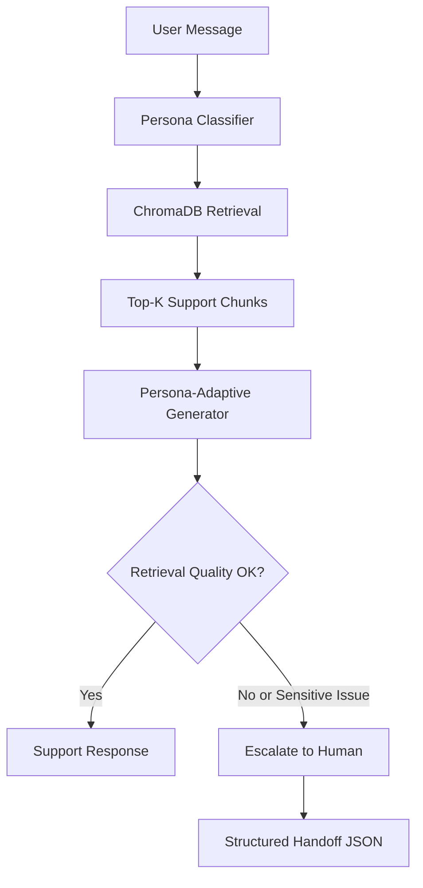

# Persona Support Agent

Persona Support Agent is a Streamlit app that classifies a customer message into a support persona, retrieves relevant knowledge-base snippets from ChromaDB, and generates a persona-aware response with Gemini.

## What it does

- Detects the likely customer persona from the message.
- Searches a local ChromaDB knowledge base for related support content.
- Generates a tailored answer based on the detected persona.
- Escalates to a human specialist when the request looks risky or billing-related.

## Tech Stack

- Python
- Streamlit
- Google Gemini API via `google-genai`
- ChromaDB for vector storage and retrieval
- LangChain text splitter for chunking seeded documents
- pypdf for reading support PDFs from the knowledge-base folder

## Project Structure

- `app.py` - main Streamlit application
- `src/` - modular app logic for config, classifier, RAG, generator, and escalation
- `requirements.txt` - Python dependencies
- `data/` - support documents used to seed the vector database
- `README.md` - project overview and setup guide
- `chroma_db/` - local ChromaDB storage created at runtime

## Architecture



The app follows the same reference flow: classify the persona, retrieve relevant support content, generate a context-grounded answer, and escalate when the query is sensitive or the retrieval confidence is low.

## Prerequisites

- Python 3.10 or newer
- A valid Gemini API key
- Internet access for Gemini API calls

## Setup

1. Create and activate a virtual environment.
2. Install the dependencies:

```bash
pip install -r requirements.txt
```

3. Create a `.env` file in the project root with your Gemini API key:

```env
GEMINI_API_KEY=your_api_key_here
```

## Knowledge Base Files

The app now loads documents from the `data/` folder instead of relying on inline seed text. It expects support content in:

- `.md` files for markdown help articles
- `.txt` files for plain-text notes
- `.pdf` files for longer instructions or reference guides

On first run, the app chunks and embeds those files into a persistent ChromaDB collection named `support_kb`.

Current support documents include API troubleshooting, authentication, billing, login recovery, password reset, invoice handling, service status, refund escalation, and account access guidance.

## Run the App

Start the Streamlit app with:

```bash
streamlit run app.py
```

Then open the local URL shown in the terminal.

## How It Works

1. The app loads environment variables and checks for `GEMINI_API_KEY`.
2. It creates or opens a persistent ChromaDB collection called `support_kb`.
3. On first run, it seeds the collection from the files in `data/`.
4. When a user submits a message, the app:
	- classifies the persona,
	- creates an embedding for the query,
	- retrieves the closest knowledge-base chunks,
	- generates a response using Gemini,
	- or escalates if the issue looks like billing or low-confidence retrieval.

## Example Inputs

- `I forgot my password. How do I reset it?`
- `Why was I charged twice for the same order?`
- `We need a high-level summary of the issue and timeline.`

## Notes for Contributors

- The app uses a local persistent ChromaDB folder, so deleting `chroma_db/` will reset the seeded knowledge base.
- Keep the `data/` folder populated with support content so the app can rebuild the vector store if needed.
- Keep `.env` out of version control.
- If you change model names or API behavior, update both `app.py` and `requirements.txt` accordingly.

## Troubleshooting

- If the app stops with a missing environment variable error, confirm `.env` contains `GEMINI_API_KEY`.
- If Streamlit shows dependency errors, reinstall packages with `pip install -r requirements.txt`.
- If responses seem incorrect, remove `chroma_db/` to reseed the knowledge base on the next run.